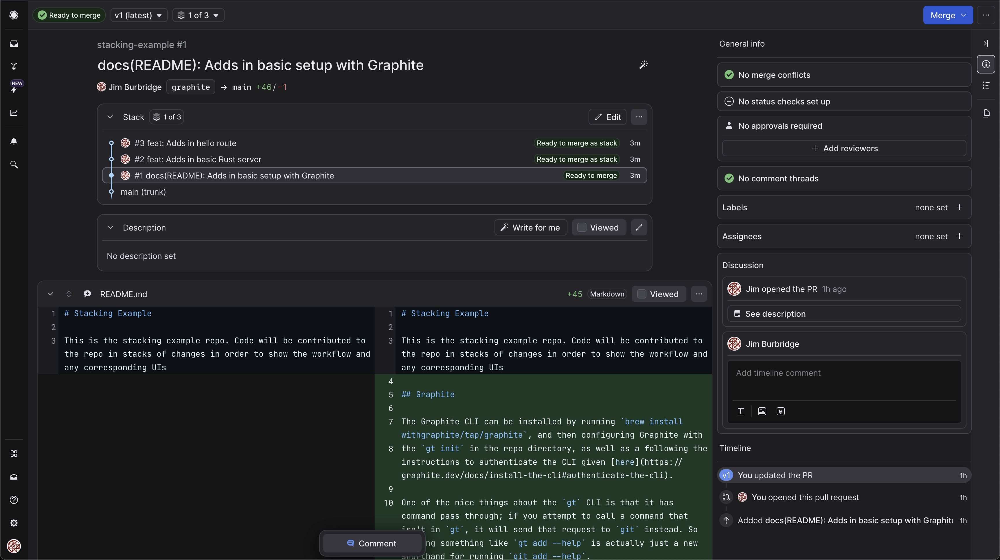

# Stacking Example

This is the stacking example repo. Code will be contributed to the repo in stacks of changes in order to show the workflow and any corresponding UIs

## Graphite

The Graphite CLI can be installed by running `brew install withgraphite/tap/graphite`, and then configuring Graphite with 
the `gt init` in the repo directory, as well as a following the instructions to authenticate the CLI given [here](https://graphite.dev/docs/install-the-cli#authenticate-the-cli).

One of the nice things about the `gt` CLI is that it has command pass through; if you attempt to call a command that isn't in `gt`, it will send that request to `git` instead. So running something like `gt add --help` is actually just a new shorthand for running `git add --help`.

### Branches / Starting a Stack

To create a new branch, you have a few options. These are shamelessly stolen from Graphite's own docs

```sh
# navigate to the trunk branch of your repository
gt trunk

# * build part 1 of your feature *

# the following two commands create a new branch off of main with your changes and add a commit

# add all unstaged changes (same syntax as git add)
gt add -A
# create a commit on a new branch with its name inferred from your commit message
gt create
# OR specify your commit message via an option, just like git
gt create -m "part 1"
# OR you can also specify a branch name yourself
gt create making_part_1
# This works too!
gt create -m "part 1" making_part_1


# If you don't run `add`, you'll be prompted to add your changes interactively.
# You can also run `add` as part of the create command with the `-a` flag
gt create -am "part 1"

# You can make the previous command even shorter by using an alias (most common gt commands have an alias, and you can even configure your own!)
gt c -am "part 1"
```

I'm partial to creating my own branches (e.g. `gt create graphite`), but whatever works for you.

To turn this single branch into a PR on GitHub, you can use the `gt submit` command.

### Next Branch

For this example we run 

```sh
$ gt create feat/add-basic-rust-server
$ cargo init
```

This initializes an empty rust project. Let's go ahead and update `Cargo.toml` to have `rocket = "0.5.0"` under the `[dependencies]` section.

Next we change `src/main.rs` to contain the following

```rust

#[macro_use] extern crate rocket;

#[get("/")]
fn index() -> &'static str {
    "Hello, world!"
}

#[launch]
fn rocket() -> _ {
    rocket::build().mount("/", routes![index])
}

// Downstream: Add in more routes
```

Verify it runs by using `cargo run`. Once you've done that, call `gt modify -m "feat: Adds in basic Rust server"`

### Next-Next Branch

Again, run `gt create feat/add-in-hello-route`. 

In `main.rs` add in the following, replacing the `// Downstrea: Add in more routes` comment

```rust
#[post("/hello/<name>")]
fn hello(name: &str) -> String {
    format!("Hi {name}")
}
```

Also, modify line #11 to read 

```rust
    rocket::build().mount("/", routes![index, hello])
```
### End Result

We now have a stack of 3 pull requests open on our repo. The second part of Graphite is the web UI for viewing stacked diffs. 

If we navigate to [the Stack](https://app.graphite.dev/github/pr/jhechtf/stacking-example/1/docs-README-Adds-in-basic-setup-with-Graphite), we should see that this links to our first PR. 



The Graphite UI is very navigable without a mouse, with keyboard shortcuts such as `CMD + <up>` / `CMD + <down>` to jump to the next or previous file, respectively. As well as `CMD + <shift> + <up>` or `CMD + <shift> down` to move up or down the commit stack.

One of the small bonuses I enjoy about Graphite is that in a PR (or a more aptly named "Merge Request" or "Code Review") the code is front-and-center, with the resulting non-code information off to either side. All of these changes are saved back to GitHub, so even users who don't use Graphite can be kept updated on any changes.

#### Super Sneaky
We went back to the basis of our setup, the `feat/add-basic-rust-server` and created a new branch, `ci/adds-in-ci-tests`,
to add in a Rust format check for the code. This creates a new branching set of work. Should we continue to add things based on the `ci` branch,
we will eventually have to merge it down with 

#### Changes

**"What happens if I get changes on a PR in the middle of the stack?"** Let's say we want to go back and add a few extra commands to the repo that we've learned since staring the base `graphite` branch.

As you can see, we've added in our new "Cool Commands" section. This creates a conflict in the upstream branches, which can be resolved in the usual way that git rebasing is resolved. In my case, I resolved it by using VSCode's merge conflict editor. This is perhaps the biggest pain point of this process.

### Cool Commands

We're coming back to update the base PR with some cool commands we've found in Graphite

1. `gt checkout` - Every PR in a stack is just a different branch and can be checked out as normal. You can also use `gt switch` if that's more your speed.
2. `gt up` switches to the child of the current branch. Will prompt if ambiguous.
3. `gt down` switches to the parent of the current branch. Will prompt if ambiguous.
